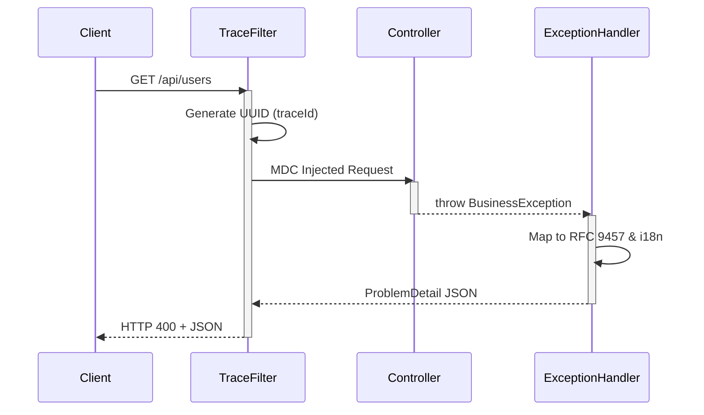

<div align="center">
  <h1>🚀 API Standard for Spring Boot</h1>
  <p><b>Bring organization-wide API consistency to every Spring Boot service.</b></p>
  <p><i>Turn Spring Boot into a governed API platform with one dependency. Standardize responses, errors, tracing, and OpenAPI documentation automatically.</i></p>
  
  [](https://github.com/saul789/spring-boot-starter-api-standard/actions/workflows/publish.yml)
  [](https://github.com/saul789/spring-boot-starter-api-standard/releases)
  [](https://adoptium.net/)
  [](https://spring.io/projects/spring-boot)
  [](LICENSE)
  
  <br/>
  
  <p align="center">
    <!-- Replace this with a real screenshot of Swagger UI showing Success Response, RFC 9457 Error and traceId
    
    -->
  </p>
</div>

---

## 🚫 Stop Copy-Pasting API Infrastructure

Most organizations eventually create:
- Duplicated `GlobalExceptionHandler`s in every project
- Inconsistent `ApiResponse` wrappers
- Incompatible error formats across teams
- Fragmented Swagger contracts

**This starter centralizes those cross-cutting concerns into a single reusable standard.** Stop reinventing the wheel and eliminate boilerplate technical debt.

## 🏢 Ideal For
- Multi-team microservice environments
- Internal Platform Teams (Platform Engineering)
- Enterprise API Governance Initiatives
- Organizations adopting RFC 9457 (Problem Details)
- Teams standardizing observability and tracing

---

## ⚡ Zero-Configuration Philosophy

- **No annotations** on your controllers.
- **No inheritance** of base classes.
- **No custom exception handlers** to maintain.
- **No duplicated response wrappers**.

Add the dependency and keep building your API. We handle the rest.

---

## 🚀 Quick Start

### 1. Add the dependency

```xml
<dependency>
    <groupId>io.github.saul789</groupId>
    <artifactId>api-standard-spring-boot-starter</artifactId>
    <version>1.2.0</version>
</dependency>
```

### 2. Create a normal controller

```java
@RestController
@RequestMapping("/api/users")
public class UserController {

    @GetMapping("/{id}")
    public User get(@PathVariable String id) {
        throw new BusinessException(ErrorCode.NOT_FOUND, "User not found", HttpStatus.NOT_FOUND);
    }
}
```

### 3. Automatic API Governance Enabled

Without writing any boilerplate, your API now automatically returns standardized responses, RFC 9457 errors, traceIds, auto-generated OpenAPI schemas, and translated messages.

---

## 📦 The Standard Contract

By simply returning objects or throwing exceptions, the starter enforces a rigorous contract globally:

### ✅ Success Response (200 OK)
```json
{
  "success": true,
  "timestamp": "2026-05-10T18:34:45Z",
  "data": { 
      "id": "123", 
      "name": "Jane Doe" 
  }
}
```

### ❌ Error Response (RFC 9457 Compliant)
```json
{
  "type": "https://api.yourdomain.com/errors/not-found",
  "title": "User Not Found",
  "status": 404,
  "detail": "User with ID 123 does not exist",
  "instance": "/api/users/123",
  "code": "NOT_FOUND",
  "timestamp": "2026-05-10T18:34:46Z",
  "traceId": "5f9b3b8c-1234-4a56-b789-abcdef123456"
}
```

> 💡 **Bonus: Transparent MDC Logging**
> Every request gets a `traceId` injected into SLF4J MDC instantly. Watch your logs become 10x easier to debug:
> `INFO [traceId: 5f9b3b8c-1234...] c.s.UserController: Fetching user 123`

---

## ✨ The Organizational Savings

| Capability | Traditional Setup | This Starter |
|---|---|:---:|
| **RFC 9457 Compliance** | Manual construction | ✅ Automatic |
| **OpenAPI Response Wrapping** | Manual annotations on every method | ✅ Automatic |
| **TraceId Propagation** | Custom Servlet filters | ✅ Built-in |
| **Error Translation (i18n)** | Custom boilerplate | ✅ Built-in |
| **Organization-wide Consistency**| Hard to enforce | ✅ Automatic |

---

## 🔍 Before vs After

**Before (Manual & Boilerplate):**
```diff
- @RestControllerAdvice
- public class GlobalExceptionHandler { ... }
-
- public class ApiResponse<T> { ... }
-
- @Component
- public class TraceFilter extends OncePerRequestFilter { ... }
-
- @PostMapping
- @ApiResponses({
-     @ApiResponse(responseCode = "200", description = "Success"),
-     @ApiResponse(responseCode = "400", description = "Bad Request")
- })
- public ResponseEntity<ApiResponse<User>> createUser(@RequestBody UserRequest request) { ... }
```

**After (Using this Starter):**
```diff
+ @PostMapping
+ @ResponseStatus(HttpStatus.CREATED)
+ public User createUser(@Valid @RequestBody UserRequest request) {
+     return userService.create(request);
+ }
```

---

## 🛡️ Enterprise-Grade Foundations

Built for large-scale microservice platforms from day one:
- ✅ **Stateless & thread-safe**
- ✅ **Native Spring Boot Auto-configuration**
- ✅ **RFC 9457** strictly compliant
- ✅ **OpenAPI v3** native auto-wrapping
- ✅ **Works with OpenFeign & Resilience4j**

## ⚙️ How It Works (For the Skeptics)

The starter integrates deeply with Spring Boot auto-configuration:
- `ResponseBodyAdvice` standardizes responses automatically.
- `@RestControllerAdvice` maps exceptions into RFC 9457 format.
- Servlet filters propagate `traceId` into the SLF4J MDC.
- OpenAPI schemas are rewritten dynamically at runtime.
- `MessageSource` enables transparent i18n translation.

*No annotations required.*

---

## 🗺️ Platform Vision (V2 Roadmap)

Building the ultimate API governance platform for Spring Boot:
- **Plugin SPI:** Custom ProblemDetail enrichers via `spring.factories`.
- **Metrics Integration:** Micrometer auto-counters for ErrorCodes.
- **Security Mapping:** Native Spring Security exception handling.
- **Observability:** Deeper integration with OpenTelemetry and tracing ecosystems.

---

## 🛠️ Architecture Overview

<details>
<summary><b>Click to view architecture diagram</b></summary>


</details>

---

## 🤝 Contributing & Testing

- **API Client Collection:** Available in `sample-project/postman/spring-boot-starter-api-standard.postman_collection.json`. *(Importable in Postman, Insomnia, Bruno, Hoppscotch, etc.)*
- **Interactive Documentation:** Check the GitHub Pages branch for the Redocly auto-generated site.

## 📄 License
This project is licensed under the Apache License 2.0 - see the [LICENSE](LICENSE) file for details.

---
**Do you find this useful?** Give us a ⭐ on GitHub to support the project!