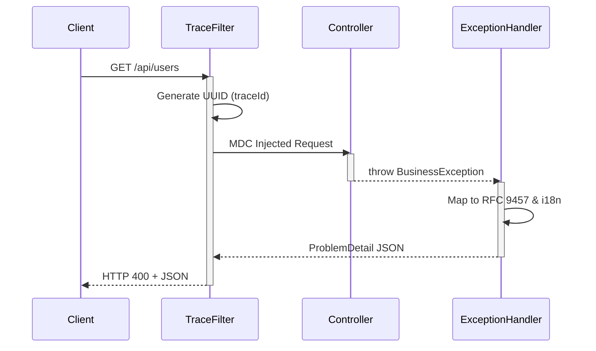

<div align="center">
  <h1>🚀 Spring Boot Starter: API Standard</h1>
  <p><b>Enterprise-grade API Standardization, RFC 9457 Errors, Trace Context & OpenAPI Auto-Integration</b></p>
  
  [](https://github.com/saul789/spring-boot-starter-api-standard/actions/workflows/publish.yml)
  [](https://github.com/saul789/spring-boot-starter-api-standard/releases)
  [](https://adoptium.net/)
  [](https://spring.io/projects/spring-boot)
  [](LICENSE)
  <br/>
  <i>Stop writing boilerplate for API responses, error handling, and tracing in every Spring Boot service.</i>
</div>

---

## ✨ The Problem vs The Solution

| ❌ Without this Starter | ✅ With API Standard Starter |
|---|---|
| **Response Format** varies per team/service | **Unified Envelope** (`data`, `success`, `timestamp`) |
| **Error Responses** are custom and inconsistent | **RFC 9457 `ProblemDetail`** enforced globally |
| **Debugging** requires grep-ing logs blindly | **`traceId` MDC propagation** instantly tracks requests |
| **OpenAPI Docs** need manual `@ApiResponse` on everything | **Zero Annotations** auto-generated schemas |
| **Microservice Errors** (Feign) swallowed | **Mapped** transparently to standard RFC 9457 |

### 🔍 Code & JSON Before vs After

**The Controller Code:**
```diff
- @PostMapping
- @ApiResponses({
-     @ApiResponse(responseCode = "200", description = "Success"),
-     @ApiResponse(responseCode = "400", description = "Bad Request")
- })
- public ResponseEntity<ApiResponse<User>> createUser(@RequestBody UserRequest request) {
-    try {
-        return ResponseEntity.ok(new ApiResponse<>(true, userService.create(request)));
-    } catch (Exception e) {
-        return ResponseEntity.status(400).body(new ApiResponse<>(false, e.getMessage()));
-    }
- }

+ @PostMapping
+ @ResponseStatus(HttpStatus.CREATED)
+ public User createUser(@Valid @RequestBody UserRequest request) {
+     return userService.create(request);
+ }
```

**The Error Response (RFC 9457):**
```diff
- {
-   "success": false,
-   "error": "Bad request",
-   "message": "Email already exists"
- }

+ {
+   "type": "urn:problem-type:conflict",
+   "title": "Conflict",
+   "status": 409,
+   "detail": "Email already exists",
+   "instance": "/api/demo/users",
+   "code": "CONFLICT",
+   "timestamp": "2023-10-25T10:05:00Z",
+   "traceId": "5f9b3b8c-1234-4a56-b789-abcdef123456"
+ }
```

---

## ⚡ Quick Start (30 Seconds)

**1. Add the dependency:**
```xml
<dependency>
    <groupId>io.github.saul789</groupId>
    <artifactId>api-standard-spring-boot-starter</artifactId>
    <version>1.2.0</version>
</dependency>
```

**2. Run your app. You're done.**
Your API is now wrapped in a standard response envelope, RFC 9457 compliant, trace-enabled, and auto-documented in Swagger!

---

## 🛠️ Core Features

### 🛡️ 1. Global Exception Handling (RFC 9457)
Intercepts all exceptions (Validation, Business, Spring Security, Feign, Resilience4j) and translates them into the rigorous `ProblemDetail` specification.

```json
{
    "type": "urn:problem-type:bad-request",
    "title": "Bad Request",
    "status": 400,
    "detail": "Email already exists",
    "instance": "/api/users",
    "code": "BAD_REQUEST",
    "timestamp": "2023-10-25T10:05:00Z",
    "traceId": "5f9b3b8c-1234-4a56-b789-abcdef123456"
}
```

### 📦 2. Fluent Business Exceptions
Throw domain-specific errors gracefully using our fluent builder API:
```java
throw BusinessException.builder("error.user.not_found")
    .status(HttpStatus.NOT_FOUND)
    .code(ErrorCode.NOT_FOUND)
    .build();
```

### 🌍 3. Built-in i18n & Actuator Endpoint
- **i18n:** Resolves `detail` and `title` using Spring's `MessageSource` via the `Accept-Language` header automatically.
- **Actuator:** Check all registered error codes via `GET /actuator/api-errors`.

### 🔄 4. Zero-Config OpenAPI / Swagger
If `springdoc-openapi` is present, it auto-configures your Swagger UI. It wraps `200 OK` schemas in the ApiResponse envelope and registers `ProblemDetail` schemas for 400/500 errors—without a single `@ApiResponse` annotation.

> 📸 **Preview:**
> 
> *<p align="center"></p>*
> *(Para agregar tu propia foto: toma un screenshot de tu Swagger local, guárdalo en la carpeta `docs/assets/swagger.png` y cambia este enlace en el README).*

### 🔗 5. Dynamic Documentation URIs
Easily override the default `urn:problem-type:` with real URLs pointing to your company's Developer Portal via `application.yml` or the `@ProblemType` annotation.

---

## 🏗️ Architecture



---

## 🔮 Coming in V2.0 (Enterprise Extensibility)
We are currently building the next generation of this starter, focusing on enterprise scale:
- 🔌 **Plugin SPI:** Inject custom metadata (like `UserId` or `TenantId`) into your errors via `spring.factories`.
- 📊 **Micrometer Metrics:** Auto-generated Grafana-ready metrics for every `ErrorCode`.
- 🔐 **Spring Security Native Integration:** Map `AccessDeniedException` effortlessly.
- 📜 **Strict Checkstyle & Javadoc Enforcement.**

---

## 🤝 Contributing & Testing
- **Postman Collection:** Available in `sample-project/postman/spring-boot-starter-api-standard.postman_collection.json`. *(Must be kept updated with every PR!)*
- **Documentation:** Interactive Docs generated via Redocly on GitHub Pages.

## 📄 License
This project is licensed under the Apache License 2.0 - see the [LICENSE](LICENSE) file for details.

<div align="center">
  <i>Built with ❤️ for a better Spring Boot ecosystem.</i>
</div>