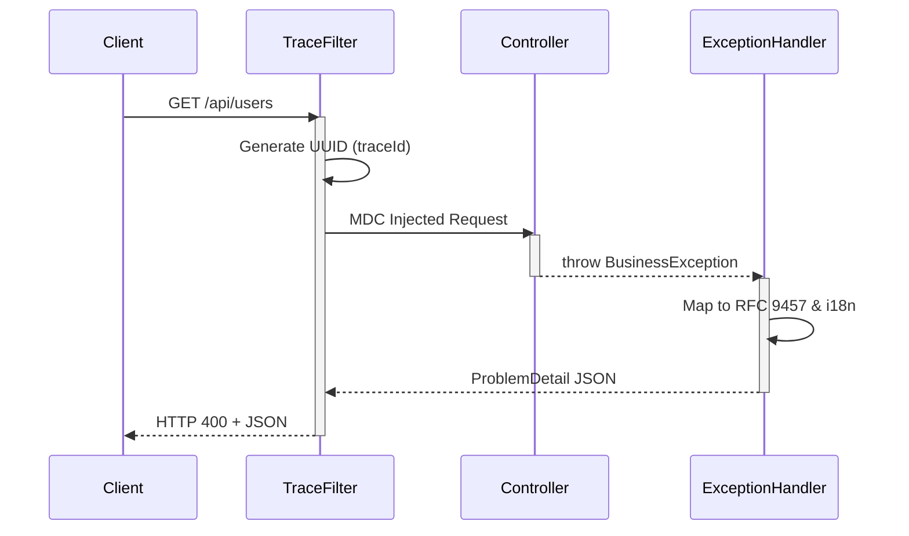

<div align="center">
  <h1>🚀 API Standard for Spring Boot</h1>
  <p><b>The missing API governance layer for Spring Boot.</b></p>
  <p><i>Zero-config API governance for Spring Boot microservices. One dependency to standardize responses, errors, tracing, and API documentation across all your services.</i></p>
  
  [](https://github.com/saul789/spring-boot-starter-api-standard/actions/workflows/publish.yml)
  [](https://github.com/saul789/spring-boot-starter-api-standard/releases)
  [](https://adoptium.net/)
  [](https://spring.io/projects/spring-boot)
  [](LICENSE)
</div>

---

## ❓ Why?

Every Spring Boot team eventually reinvents the same wheel:
- API response wrappers
- Global exception handlers
- Trace propagation via MDC
- Boilerplate Swagger annotations
- Feign/Resilience4j error mapping

**This starter turns those cross-cutting concerns into a reusable standard.** Stop rewriting boilerplate in every microservice. 

## ⚡ Zero-Configuration Philosophy

- **No annotations** on your controllers.
- **No inheritance** of base classes.
- **No custom exception handlers** to maintain.
- **No duplicated response wrappers**.

Add the dependency and keep building your API. We handle the rest.

---

## 🚀 Quick Start

### 1. Add the dependency

```xml
<dependency>
    <groupId>io.github.saul789</groupId>
    <artifactId>api-standard-spring-boot-starter</artifactId>
    <version>1.2.0</version>
</dependency>
```

### 2. Create a normal controller

```java
@RestController
@RequestMapping("/api/users")
public class UserController {

    @GetMapping("/{id}")
    public User get(@PathVariable String id) {
        throw new BusinessException(ErrorCode.NOT_FOUND, "User not found", HttpStatus.NOT_FOUND);
    }
}
```

### 3. Done. The Magic happens.

Without writing any boilerplate, your API now automatically returns:
- ✅ **Standardized Responses:** Wrapped in a clean `{ success, data, timestamp }` envelope.
- ✅ **RFC 9457 Errors:** Fully compliant `ProblemDetail` JSON on exceptions.
- ✅ **Distributed Tracing:** `traceId` auto-generated and propagated to MDC logs.
- ✅ **Translated Messages:** Multi-language support via Spring `MessageSource`.
- ✅ **OpenAPI Schemas:** Swagger UI automatically documents the exact response and error structures.

<!-- Sube un GIF animado aquí mostrando el resultado en Postman o el Swagger UI funcionando -->

---

## 🛡️ Production Ready

Built for enterprise scale from day one:
- ✅ Stateless & thread-safe
- ✅ Native Spring Boot Auto-configuration
- ✅ RFC 9457 (Problem Details) strictly compliant
- ✅ OpenAPI v3 native auto-wrapping
- ✅ MDC trace propagation included
- ✅ Works flawlessly with OpenFeign & Resilience4j

## ⚙️ Compatibility

| Version | Spring Boot | Java |
|---------|-------------|------|
| **1.x** | 4.x         | 21+  |

---

## 🛠️ Architecture Overview



## 🔍 Before vs After (Zero-Config Magic)

**Before (Manual & Boilerplate):**
```diff
- @PostMapping
- @ApiResponses({
-     @ApiResponse(responseCode = "200", description = "Success"),
-     @ApiResponse(responseCode = "400", description = "Bad Request")
- })
- public ResponseEntity<ApiResponse<User>> createUser(@RequestBody UserRequest request) {
-    try {
-        return ResponseEntity.ok(new ApiResponse<>(true, userService.create(request)));
-    } catch (Exception e) {
-        return ResponseEntity.status(400).body(new ApiResponse<>(false, e.getMessage()));
-    }
- }
```

**After (Using this Starter):**
```diff
+ @PostMapping
+ @ResponseStatus(HttpStatus.CREATED)
+ public User createUser(@Valid @RequestBody UserRequest request) {
+     return userService.create(request);
+ }
```

---

## 🗺️ Roadmap (Coming in V2)

- Plugin SPI (Custom ProblemDetail enrichers via `spring.factories`)
- Micrometer Metrics integration for ErrorCodes
- Native Spring Security Exception mapping
- Observability support

---

## 🤝 Contributing & Testing

- **Postman Collection:** Available in `sample-project/postman/spring-boot-starter-api-standard.postman_collection.json`. 
- **Interactive Documentation:** Check the GitHub Pages branch for the Redocly auto-generated site.

## 📄 License
This project is licensed under the Apache License 2.0 - see the [LICENSE](LICENSE) file for details.