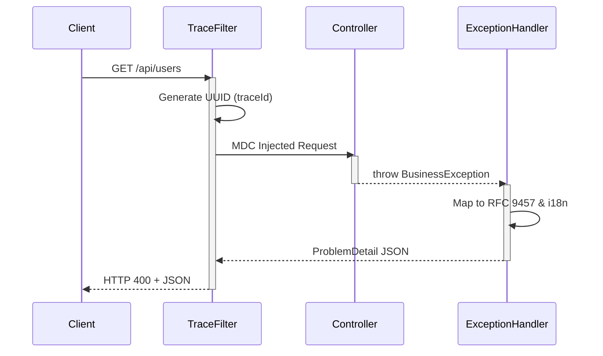

<div align="center">
  <h1>🚀 API Standard for Spring Boot</h1>
  <p><b>Bring organization-wide API consistency to every Spring Boot service.</b></p>
  <p><i>Turn Spring Boot into a governed API platform with one dependency. Standardize responses, errors, tracing, and OpenAPI documentation automatically.</i></p>
  
  [](https://github.com/saul789/spring-boot-starter-api-standard/actions/workflows/publish.yml)
  [](https://github.com/saul789/spring-boot-starter-api-standard/releases)
  [](https://adoptium.net/)
  [](https://spring.io/projects/spring-boot)
  [](LICENSE)
</div>

---

## 🎯 Designed For
- Platform Engineering Teams
- Enterprise Microservice Architectures
- Internal Developer Platforms (IDP)
- API Governance Initiatives

## ❓ Why Not Just Build It Yourself?

Because API standardization becomes exponentially harder at scale. What starts as a simple "response wrapper" eventually grows into:
- Strict RFC 9457 (Problem Details) compliance
- OpenAPI schema synchronization
- Distributed tracing and MDC propagation
- i18n support across all errors
- Feign and Resilience4j exception translation
- Organization-wide consistency

**This starter consolidates those concerns into one reusable standard.** Stop reinventing the wheel in every new microservice.

---

## ⚡ Zero-Configuration Philosophy

- **No annotations** on your controllers.
- **No inheritance** of base classes.
- **No custom exception handlers** to maintain.
- **No duplicated response wrappers**.

Add the dependency and keep building your API. We handle the governance.

---

## 🚀 Quick Start

### 1. Add the dependency

```xml
<dependency>
    <groupId>io.github.saul789</groupId>
    <artifactId>api-standard-spring-boot-starter</artifactId>
    <version>1.2.0</version>
</dependency>
```

### 2. Create a normal controller

```java
@RestController
@RequestMapping("/api/users")
public class UserController {

    @GetMapping("/{id}")
    public User get(@PathVariable String id) {
        throw new BusinessException(ErrorCode.NOT_FOUND, "User not found", HttpStatus.NOT_FOUND);
    }
}
```

### 3. Automatic API Governance Enabled

Without writing any boilerplate, your API now automatically returns standardized responses, RFC 9457 errors, traceIds, auto-generated OpenAPI schemas, and translated messages.

---

## 📦 The Standard Contract

By simply returning objects or throwing exceptions, the starter enforces a rigorous contract globally:

### ✅ Success Response (200 OK)
```json
{
  "success": true,
  "timestamp": "2026-05-10T18:34:45Z",
  "data": { 
      "id": "123", 
      "name": "Jane Doe" 
  }
}
```

### ❌ Error Response (RFC 9457 Compliant)
```json
{
  "type": "https://api.yourdomain.com/errors/not-found",
  "title": "User Not Found",
  "status": 404,
  "detail": "User with ID 123 does not exist",
  "instance": "/api/users/123",
  "code": "NOT_FOUND",
  "timestamp": "2026-05-10T18:34:46Z",
  "traceId": "5f9b3b8c-1234-4a56-b789-abcdef123456"
}
```

> 💡 **Bonus: Transparent MDC Logging**
> Every request gets a `traceId` injected into SLF4J MDC instantly. Watch your logs become 10x easier to debug:
> `INFO [traceId: 5f9b3b8c-1234...] c.s.UserController: Fetching user 123`

---

## ✨ Core Features

| Feature | Included |
|---|:---:|
| **RFC 9457 Problem Details** | ✅ |
| **OpenAPI Auto-Wrapping** | ✅ |
| **TraceId MDC Propagation** | ✅ |
| **Global Exception Handling** | ✅ |
| **i18n Error Translation** | ✅ |
| **Feign Error Mapping** | ✅ |
| **Resilience4j Integration** | ✅ |
| **Zero-Config Setup** | ✅ |

---

## 🔍 Before vs After

**Before (Manual & Boilerplate):**
```diff
- @PostMapping
- @ApiResponses({
-     @ApiResponse(responseCode = "200", description = "Success"),
-     @ApiResponse(responseCode = "400", description = "Bad Request")
- })
- public ResponseEntity<ApiResponse<User>> createUser(@RequestBody UserRequest request) {
-    try {
-        return ResponseEntity.ok(new ApiResponse<>(true, userService.create(request)));
-    } catch (Exception e) {
-        return ResponseEntity.status(400).body(new ApiResponse<>(false, e.getMessage()));
-    }
- }
```

**After (Using this Starter):**
```diff
+ @PostMapping
+ @ResponseStatus(HttpStatus.CREATED)
+ public User createUser(@Valid @RequestBody UserRequest request) {
+     return userService.create(request);
+ }
```

---

## 🛡️ Production Ready

Built for enterprise scale from day one:
- ✅ **Stateless & thread-safe**
- ✅ **Native Spring Boot Auto-configuration**
- ✅ **RFC 9457** strictly compliant
- ✅ **OpenAPI v3** native auto-wrapping
- ✅ **Works with OpenFeign & Resilience4j**

## ⚙️ Compatibility

| Version | Spring Boot | Java |
|---------|-------------|------|
| **1.x** | 3.3+ / 4.x  | 21+  |

---

## 🗺️ Platform Vision (V2 Roadmap)

Building the ultimate API governance platform for Spring Boot:
- **Plugin SPI:** Custom ProblemDetail enrichers via `spring.factories`.
- **Metrics Integration:** Micrometer auto-counters for ErrorCodes.
- **Security Mapping:** Native Spring Security exception handling.
- **Observability:** Deeper integration with OpenTelemetry and tracing ecosystems.

---

## 🛠️ Architecture Overview

<details>
<summary><b>Click to view architecture diagram</b></summary>


</details>

---

## 🤝 Contributing & Testing

- **Postman Collection:** Available in `sample-project/postman/spring-boot-starter-api-standard.postman_collection.json`. 
- **Interactive Documentation:** Check the GitHub Pages branch for the Redocly auto-generated site.

## 📄 License
This project is licensed under the Apache License 2.0 - see the [LICENSE](LICENSE) file for details.