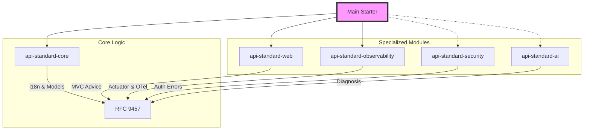

# 🗺️ ROADMAP — api-standard-spring-boot-starter

> **Nota Crítica:** Todas las versiones mantienen cumplimiento estricto con **RFC 9457 (Problem Details)** y **RFC 9110 (HTTP Semantics)**.

## ✅ V1.0 — Cimientos (Completado)
- [x] Soporte para RFC 9457 (`ProblemDetail`).
- [x] `GlobalExceptionHandler` con soporte i18n.
- [x] Filtro de `traceId` (W3C Trace Context).
- [x] Wrapper de respuestas exitosas (`ApiResponse`).

## ✅ V1.1 — Resiliencia y Feign (Completado)
- [x] Integración con Resilience4j (Circuit Breaker, Rate Limiter).
- [x] Manejo de excepciones de OpenFeign.
- [x] Customización de URLs de documentación vía `@ProblemType`.

## ✅ V1.2 — OpenAPI y Estabilidad (Completado)
- [x] Integración automática con SpringDoc OpenAPI (auto-wrapping).
- [x] CI/CD Pipeline estable con calidad de código (Sonar/SpotBugs).
- [x] **Upgrade a Spring Boot 4.0.6 (Security Patching)**.
- [x] Documentación Actuator (`/actuator/api-errors`).

---

## 🏗️ Vision Architecture (Modular V2.0)

## 🚀 V2.0 — Modularización & Enterprise (En Planificación)

### 📦 Arquitectura Modular (Anti Scope Creep)
- [ ] **Split by Modules**: Dividir el starter en: `core`, `security`, `observability`, `ai`, `webflux` y `governance`.
- [ ] **Mesh-Awareness Mode**: Detección de headers de Service Mesh (Envoy/Istio) para evitar conflictos de reintentos y telemetría duplicada.
- [ ] **Degraded Mode**: Sistema de autoprotección que desactiva funciones costosas (IA, Snapshots) bajo alta carga de CPU/Memoria.

### 🛡️ Seguridad & Gobernanza (Governance-as-Code)
- [ ] **Build-Time Enforcement**: Fallar el build si hay ErrorCodes sin traducción, sin owner o sin documentación OpenAPI.
- [ ] **Redaction Engine**: Ofuscación de PII (Emails, Tarjetas) en logs y JSON mediante reglas eficientes (no solo Regex).
- [ ] **Spring Security Integration**: Unificación de errores de seguridad al formato ProblemDetail.

### 📊 Observabilidad & DX
- [ ] **OpenTelemetry Alignment**: Mapear atributos de error a las convenciones semánticas oficiales de OpenTelemetry.
- [ ] **Contract Safety Tests**: Detección de breaking changes en el esquema JSON durante el build.
- [ ] **SBA Integration (Optional)**: Módulo opcional para visualización en Spring Boot Admin.

---

## 🔭 V3.0 — Error Intelligence Platform (Visionario)

### 🤖 Inteligencia & Diagnóstico Seguro
- [ ] **Sanitized API Black Box**: Captura de estado (hilos, conexiones, MDC) EXCLUYENDO el heap dump para evitar fugas de secretos en memoria.
- [ ] **AI-Assisted Support (Internal)**: Herramientas de diagnóstico para el equipo de soporte (sin exposición pública).
- [ ] **Error Fingerprinting**: Hashes determinísticos para agrupar incidentes en herramientas de monitoreo.
- [ ] **JSON Schema Export**: Generación de esquemas dinámicos para validación agnóstica de contratos (Node.js/Go/TS).

### 🚀 Performance & Self-Healing
- [ ] **Error Quarantine**: Degradación automática de respuestas y fallback ante fallos masivos en endpoints específicos.
- [ ] **GraalVM Native Support**: Crucial para arquitecturas Serverless con cold starts mínimos.
- [ ] **Zero-Allocation Hot Path**: Optimización extrema de memoria para sistemas de alta frecuencia.
- [ ] **Exception Throttling**: Protección de infraestructura de logs ante ataques.
- [ ] **Retry-After Header**: Inyección automática del header HTTP basado en la carga o el tipo de error.
- [ ] **Actuator Health Integration**: Cambio de estado a `OUT_OF_SERVICE` basado en tasa de errores críticos.

### 🛡️ Seguridad Avanzada (Gobernanza)
- [ ] **Anti-Reconnaissance Mode**: Ofuscación de infraestructura (nombres de tablas, vendors de DB).
- [ ] **Redaction Engine**: Ofuscación de PII (Emails, Tarjetas) en logs y JSON.
- [ ] **Validation PII Masking**: Enmascaramiento automático de valores sensibles en errores de Bean Validation.
- [ ] **TypeScript SDK Generator**: Sincronización total del contrato de errores con el Frontend.

### 🛠️ Herramientas Pro
- [ ] **Temporal Error Graph**: Visualización tipo DAG del viaje de un error en la red.
- [ ] **IntelliJ Plugin**: Soporte nativo en el IDE para la librería.
- [ ] **SBA Integration (Optional Module)**: Vista personalizada para Spring Boot Admin consumiendo el Actuator.
- [ ] **SLA Monitoring & Alerting**: Métricas basadas en la prioridad de negocio (P1, P2, P3).
- [ ] **Dashboard UI**: Panel visual de salud y gobernanza de APIs organizacional.

---

## 📜 Seguimiento de Estándares RFC

> Monitorear estos RFCs para anticipar cambios que puedan afectar la librería.

| RFC | Título | Estado | Última revisión | Impacto en el proyecto |
|---|---|---|---|---|
| **[RFC 9457](https://www.rfc-editor.org/rfc/rfc9457)** | Problem Details for HTTP APIs | 🟢 Vigente | 2023 | ⭐ **CRÍTICO** — Es el formato base de todos los errores |
| **[RFC 9110](https://www.rfc-editor.org/rfc/rfc9110)** | HTTP Semantics | 🟢 Vigente | 2022 | 🔴 **ALTO** — Define la semántica de los status codes en `ErrorCode.java` |
| **[RFC 6585](https://www.rfc-editor.org/rfc/rfc6585)** | Additional HTTP Status Codes | 🟢 Vigente | 2012 | 🟡 **MEDIO** — Origen del `429 Too Many Requests` |
| **[RFC 7807](https://www.rfc-editor.org/rfc/rfc7807)** | Problem Details (obsoleto) | 🔴 Obsoleto | Reemplazado por RFC 9457 | ⚠️ **VIGILAR** — No implementar. Existente en APIs legadas |
| **[RFC 4918](https://www.rfc-editor.org/rfc/rfc4918)** | HTTP Extensions for WebDAV | 🟡 Estático | 2007 | 🟡 **BAJO** — Origen del `422 Unprocessable Entity` |

### Checklist de cumplimiento RFC (verificar en cada release)

- [ ] **RFC 9457:** Los campos `type`, `title`, `status` siempre presentes en toda respuesta de error
- [ ] **RFC 9457:** El campo `type` es una URI válida (URL o URN bien formada)
- [ ] **RFC 9110:** Los códigos HTTP usados corresponden a la semántica definida (no usar `500` cuando corresponde `503`)
- [ ] **RFC 6585:** `429` solo se usa para rate limiting / throttling, no para errores genéricos de cliente
- [ ] **RFC 4918:** `422` solo para validación semántica; `400` para syntax errors / requests malformados
- [ ] **RFC 7807:** No hay referencias a RFC 7807 en la documentación pública (usar siempre RFC 9457)

---
